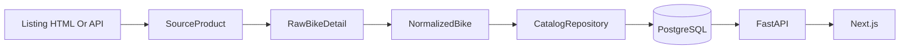

# 实现说明

## 当前已实现范围

- PostgreSQL 数据模型和首版 Alembic 迁移。
- FastAPI 应用入口和公开查询接口。
- Crawler adapter 基类、快照存储和统一标准化结构。
- Giant crawler：列表解析、详情 JSON、详情 HTML 规格表解析、几何数据解析。
- Giant 导入任务：`python -m app.tasks.run_giant --limit 20`。
- Specialized crawler：OCC 搜索接口、详情接口、规格接口、几何接口解析。
- Specialized 导入任务：`python -m app.tasks.run_specialized --limit 20`。
- Pinarello crawler：中国官网 HTML 列表、详情页变体、组件和几何表解析。
- Pinarello 导入任务：`python -m app.tasks.run_pinarello --limit 20`。
- Celery Beat 每日定时任务：每天 03:15 自动执行 Giant，全量；每天 04:15 自动执行 Specialized 全量；每天 05:15 自动执行 Pinarello 全量。
- Next.js 基础页面：首页列表、品牌页、详情页、对比页。

## 后端关键文件

- `backend/app/models/catalog.py`：品牌、来源、车型、变体、图片、规格、几何模型。
- `backend/app/models/crawler.py`：抓取任务、快照、来源映射、价格历史模型。
- `backend/app/crawlers/base.py`：crawler 抽象类和标准数据结构。
- `backend/app/crawlers/giant.py`：Giant 官网抓取实现。
- `backend/app/crawlers/specialized.py`：Specialized 中国官网抓取实现。
- `backend/app/crawlers/pinarello.py`：Pinarello 中国官网抓取实现。
- `backend/app/core/celery_app.py`：Celery worker 和 Beat 调度配置。
- `backend/app/tasks/celery_tasks.py`：Celery 任务入口。
- `backend/app/repositories/catalog.py`：标准化数据入库和查询。
- `backend/app/api/catalog.py`：公开 API。

## 后续品牌接入方式

新增品牌时实现一个 crawler 文件，例如 `backend/app/crawlers/trek.py`：

1. `crawl_listing()` 返回 `list[SourceProduct]`。
2. `crawl_detail()` 返回 `RawBikeDetail`。
3. `normalize()` 返回 `NormalizedBike`。
4. 新增对应 `backend/app/tasks/run_trek.py`，复用 `CatalogRepository.upsert_normalized_bike()`。

## 数据流



## 本地验证建议

```bash
cd workspace/road-bike-platform
docker compose up -d postgres redis

cd backend
cp .env.example .env
pip install -e ".[dev]"
alembic upgrade head
python -m app.tasks.run_giant --limit 5
python -m app.tasks.run_specialized --limit 5
python -m app.tasks.run_pinarello --limit 5
uvicorn app.main:app --reload

# 另开终端启动定时任务
celery -A app.core.celery_app.celery_app worker --loglevel=info
celery -A app.core.celery_app.celery_app beat --loglevel=info

cd ../frontend
cp .env.example .env.local
npm install
npm run dev
```

如果 `npm install` 网络较慢，可以先只运行后端和导入任务，前端源码已具备基础页面结构。

## 定时任务说明

Celery Beat 会按 `backend/app/core/celery_app.py` 中的 `beat_schedule` 投递任务：

- 任务名：`app.tasks.celery_tasks.sync_giant_products`，每天 03:15
- 任务名：`app.tasks.celery_tasks.sync_specialized_products`，每天 04:15
- 任务名：`app.tasks.celery_tasks.sync_pinarello_products`，每天 05:15
- 默认时区：`Asia/Shanghai`
- Broker：`CELERY_BROKER_URL`
- Result backend：`CELERY_RESULT_BACKEND`

每次任务都会创建一条 `crawler_jobs` 记录，状态包括：

- `running`
- `success`
- `partial_success`
- `failed`
